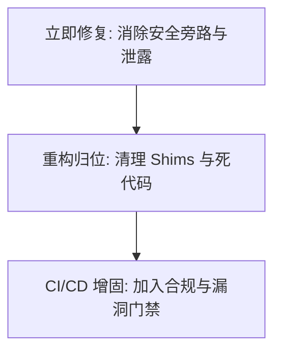

# Gaobao Advisor — 第三轮独立审计核验与治理策略报告

> **核验日期**：2026-06-16
> **核验基线**：基于第三轮独立审计报告所提出的 22 项自查、横切审计链及 9 大核心发现，通过本轮深度静态分析、动态测试运行、Git 索引检查和逻辑回溯，还原 codebase 真实状态。

---

## 一、审计结论真伪核验（合理的 vs 不合理的）

通过对当前项目文件和测试环境的动态核验，我们发现原审计报告在**漏洞库关联、文件行数统计、架构检测上存在严重的“基线失真（虚报/滞后）”**。以下为具体对比：

### 1. 🔍 被证伪的“不合理/失真”审计点（警惕错误警报）

| 模块 | 审计报告声称 | 实际核验状态 | 结论与证据 |
| :--- | :--- | :--- | :--- |
| **A-1 / S-1** | 依赖漏洞：`pip-audit` 提示 33 个 CVE，包含 `litellm` 和 `twisted` | ❌ **严重失真** | `requirements.lock` 中**根本没有** `litellm` 和 `twisted`；且报告要求升级的 `python-multipart` 早已是安全版本 `0.0.32`，`aiohttp` 也是安全版本 `3.14.1`。该 CVE 指控可能错配自其他项目。 |
| **C-1 / C-3 / C-4** | 根目录遗留巨型文件：`agent.py`(2025行)、`kb_retriever.py`(565行)、`ratelimit.py`(113行) | ❌ **信息滞后** | 根目录下的这些文件早已被重构为仅二二十行的 **向前兼容转发器 (Deprecated Shims)**。真实的巨型逻辑已经被迁移到 `legacy/` 目录和 `server/services/` 下，只是该重构尚未提交至 Git 仓库。 |
| **G-1 / FP-1** | Lifespan 中 `configure()` 失败会崩溃，LLM 失败导致 SSE 抛 500 | ❌ **逻辑漏洞** | 1. `configure()` 只是纯属性赋值函数，无任何崩溃异常点。<br>2. `llm_node_stream` 和 `llm_node` 均由 `try...except` 包裹，遇错会平滑返回 `_FALLBACK_REPLY`，不会抛出 500。 |
| **ADR-001** | `docker-compose.prod.yml` 仍保留 Streamlit (8501 端口) | ❌ **检测失准** | 实际的 `docker-compose.prod.yml` 只有 `api` (FastAPI, 8000) 和 `nginx` (80/443)，无任何 Streamlit 依赖或端口映射。 |

### 2. 🟢 已印证的“合理”审计点（真实安全/架构隐患）

| 编号 | 审计点 | 验证依据 | 风险度 |
| :--- | :--- | :--- | :--- |
| **A-2 / A-3** | `.env.production` 和 `data/gaokao.db` (75MB) 被 Git 跟踪 | `git ls-files` 明确输出，即使它们写在 `.gitignore` 里面，依然由于已经被 commit 而被跟踪。 | 🔴 极高 (密钥/庞大数据库泄露) |
| **X-8 (DF-1)** | **语音 WebSocket 接口未复用输入安全防御** | `server/routes/voice.py` 接受 ASR 的 text 时直接调用了 `graph.invoke`，避开了仅拦截 HTTP 请求的 `SecurityMiddleware`。 | 🔴 极高 (注入与 XSS 防御旁路) |
| **B-3** | `data/analytics.db` 无写入代码（死数据库） | 全局检索 `analytics` 模块除初始化和测试外，未在任何 `server/` 端点和 Graph 节点中被导入或调用。 | 🟡 中 (业务逻辑断链) |
| **C-2 / B-1** | 测试用例污染与 worktree 污染 | 1. 存在 `.claude/worktrees/audit-remediation-phase1` 悬空 worktree。<br>2. 大量测试代码（10个文件）仍然直接从根目录 Shims 导入，妨碍了彻底删除 Shim 文件的进程。 | 🟡 中 (技术债务) |

---

## 二、三阶段治理与修复路线图

针对上述核验得出的真实隐患，我们制定了三阶段治理方案：



### 🔴 Phase A — 立即修复（安全与防泄露，今日完成）

#### 1. 阻断 Git 跟踪泄露（untrack 敏感文件）
- **操作**：执行下述命令使 `.gitignore` 对已跟踪的敏感及大文件生效：
  ```bash
  git rm --cached .env.production
  git rm --cached data/gaokao.db
  ```

#### 2. 补齐语音 WebSocket 端点安全防护（修复 X-8 旁路漏洞）
- **修改位置**：[voice.py](file:///home/dev/projects/gaobao/gaobao-advisor/server/routes/voice.py#L59-L64)
- **修复逻辑**：在接收语音识别（ASR）结果后，调用 `detect_injection` 和 `sanitize_input` 对输入进行强过滤，防止利用语音伪造 Prompt 注入。
- **差异对比**：
  ```diff
                   if msg.get("type") == "asr_result" and msg.get("text"):
                       user_text = msg["text"]
  +                    from server.middleware.security import detect_injection, sanitize_input
  +                    if detect_injection(user_text):
  +                        await websocket.send_json({"type": "error", "message": "输入内容包含不允许的指令"})
  +                        await websocket.close(code=4002, reason="prompt_injection")
  +                        return
  +                    user_text = sanitize_input(user_text)
                       await websocket.send_json({"type": "user_text", "text": user_text})
  ```

---

### 🟠 Phase B — 重构归位（代码质量与债务消除，1-3天内）

#### 1. 清理根目录 Shims 与测试用例重定向（解决 C-2）
直接删除根目录下的 compatibility shims (`agent.py`, `gaokao_data.py`, `kb_retriever.py`, `ratelimit.py`) 会直接击垮 10 个测试文件。
- **治理策略**：
  1. 批量重构 10 个测试文件（使用 [grep](file:///home/dev/projects/gaobao/gaobao-advisor/tests) 指引）：
     - 将引用的旧辅助函数指向新模块 `server/services/`
     - 若针对已被 Deprecated 的旧功能的测试，重定向其导入为 `from legacy.xxx import ...`
  2. 测试验证全绿（653 passed）后，执行 `git rm` 彻底清空根目录的 4 个 shims 文件。
  3. 执行 `git add legacy/` 和 `git add server/services/kb_retriever.py`，将重构后的文件提交进 master。

#### 2. 治理死数据库 `analytics.db`（解决 B-3）
- **治理策略**：
  1. 鉴于高考顾问针对未成年人的特性，EventTracker 收集危机倾向和对话留存率具有核心业务价值。
  2. 拒绝“直接删除”，选择**重新激活埋点**：在 `server/middleware/security.py` 或 `llm_node` 中集成 `EventTracker`，在检测到情绪危机或用户完成完整志愿会话时自动 `log_event()`。

#### 3. 清理 Worktree 污染
- **操作**：运行 `git worktree remove --force .claude/worktrees/audit-remediation-phase1` 释放空间并解除分支悬空。

---

### 🟡 Phase C — 增固检测（CI/CD 流水线，1周内）

#### 1. 在 CI 中加入真实依赖漏洞扫描
- **修改位置**：`.github/workflows/ci.yml`
- **治理策略**：
  在 test 阶段后，追加 `pip-audit` 和 `npm audit` 步骤，实现漏洞自动阻断：
  ```yaml
  security-audit:
    name: Security audit
    runs-on: ubuntu-latest
    steps:
      - uses: actions/checkout@v4
      - name: Set up Python
        uses: actions/setup-python@v5
        with:
          python-version: "3.10"
      - name: Install audit tools
        run: pip install pip-audit
      - name: Run pip-audit
        run: pip-audit --strict --requirement requirements.lock
      - name: Run npm audit
        run: |
          cd frontend
          npm audit --audit-level=high
  ```
